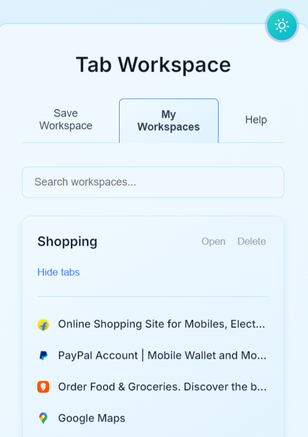

# TabRecall

A modern browser extension to save and organize open tabs into AI-summarized workspaces. This project uses Vite, React, and TypeScript along with Tailwind CSS for a beautiful and production-worthy design.

## Table of Contents
- [Features](#features)
- [Screenshots](#screenshots)
- [Getting Started](#getting-started)
- [Project Structure](#project-structure)
- [Configuration](#configuration)
- [Credits](#credits)
- [License](#license)

## Features
- **Save Workspace:** Capture current tabs and save them as a workspace.
- **Add to Workspace:** Add selected tabs to an existing workspace.
- **AI-Summarization:** Generate summaries for your tabs using Hugging Face APIs.
- **Workspace Management:** View, search, delete, and manage workspaces.
- **Tab Management:** Select, open, and delete individual tabs within a workspace.
- **Light/Dark Mode:** Toggle between light and dark themes.
- **Responsive UI:** Works seamlessly across devices with a modern, card-style interface.
- **Icon Support:** Uses Lucide React icons for logos and UI elements.
- **Customizable:** Easily modify the UI using Tailwind CSS and custom styles.

## Screenshots

### Main Popup Interface


### Workspace Overview


## Getting Started

### For End Users
1. **Download Extension:**  
   Download the zip file for TabRecall.
2. **Extract Files:**  
   Extract the downloaded zip file to your preferred location.
3. **Load the Extension in Chrome:**  
   - Open Chrome and navigate to `chrome://extensions`
   - Enable **Developer mode** by toggling the switch at the top right.
   - Click on the **Load unpacked** button.
   - Select the folder where you extracted the extension files (typically the `dist` folder after building).

### For Developers
1. **Clone the repository:**

   ```bash
   git clone https://github.com/sonisumit7904/TabRecall.git
   cd TabRecall
   ```

2. **Install dependencies:**

   ```bash
   npm install
   ```

3. **Set up environment variables:**

   Create a `.env` file at the root with your Hugging Face API Key, for example:
   ```
   VITE_HUGGINGFACE_API_KEY="your_huggingface_api_key_here"
   ```

4. **Run the development server:**

   ```bash
   npm run dev
   ```

5. **Build for production:**

   ```bash
   npm run build
   ```

## Usage

- **During Development:** Use the Vite development server to test your changes.
- **Chrome Extension:**  
  After building, load the extension in Chrome via `chrome://extensions` in developer mode by selecting the `dist` folder.
- **Workspace Actions:**  
  Save your current browsing session as a workspace, get AI-generated summaries, and manage workspaces with an intuitive UI.

## Project Structure

```
e:\COURSE\WORKSPACE-AI\
├── .env
├── background.js
├── contentScript.js
├── eslint.config.js
├── index.html
├── manifest.json
├── package.json
├── popup.html
├── popup.js
├── postcss.config.js
├── src/
│   ├── App.tsx
│   ├── index.css
│   ├── main.tsx
│   ├── vite-env.d.ts
├── styles.css
├── tailwind.config.js
├── tsconfig.app.json
├── tsconfig.json
├── tsconfig.node.json
├── vite.config.ts
└── utils/
    └── ai.js
```

## Configuration

- **API Configuration:**  
  The `.env` file holds your Hugging Face API key. This file is read by Vite during build.
- **ESLint and TypeScript:**  
  This project uses ESLint with recommended settings for React, React Hooks, and TypeScript.
- **Tailwind CSS:**  
  The UI is styled using Tailwind CSS and further customized in `styles.css`.

## Credits

- **Icons:**  
  Icons are rendered using [lucide-react](https://github.com/lucide-icons/lucide).
- **UI Inspiration:**  
  Modern designs and intuitive layouts are inspired by current trends.
- **Stock Images:**  
  Background and interface images are sourced from [Unsplash](https://unsplash.com/).

## License

This project is licensed under the MIT License.
